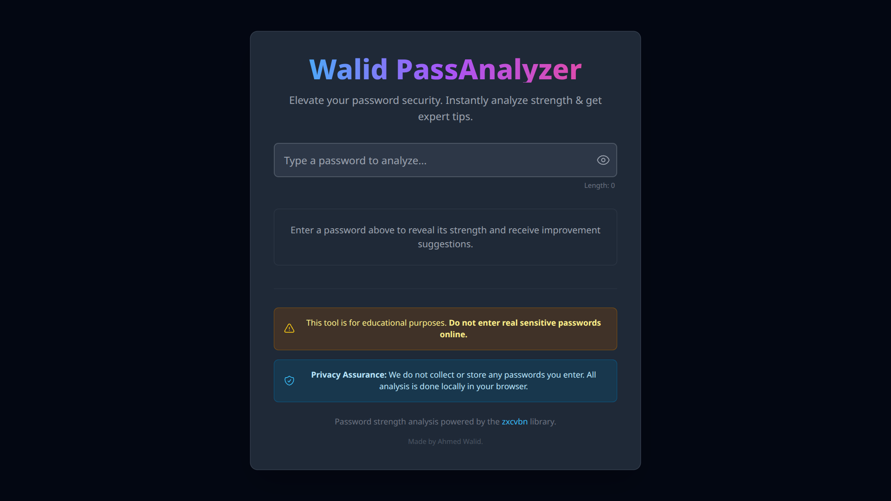
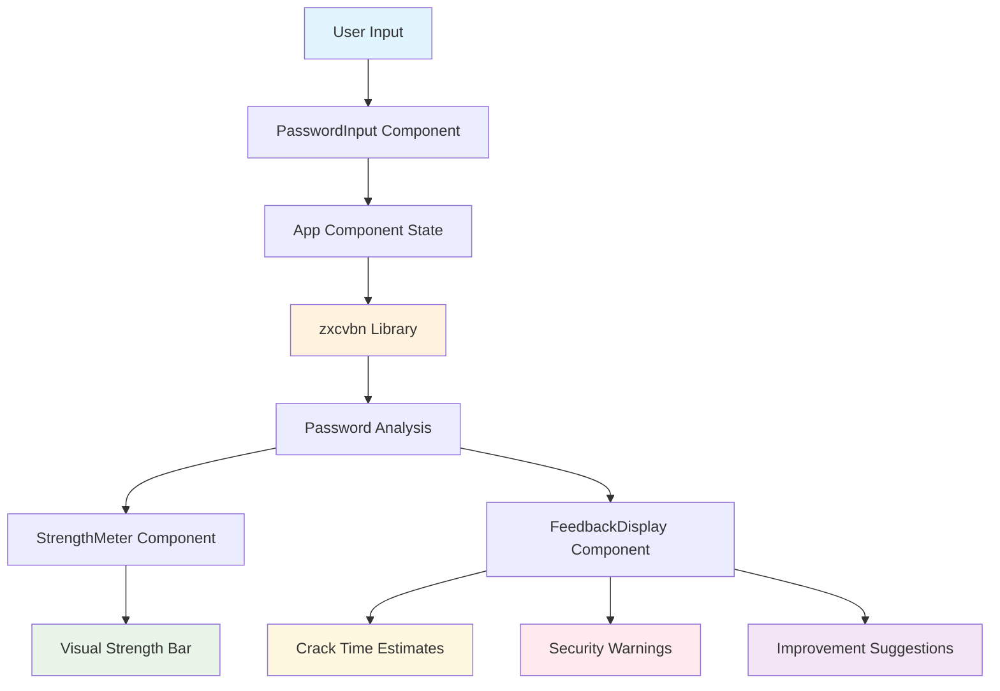

<h2 align="center">Walid PassAnalyzer</h2>

<p align="center">
    A modern, privacy-focused password strength analyzer built with React and TypeScript
    <br />
    Get instant feedback on password security with detailed crack-time estimates and actionable improvement suggestions
    <br />
    <br />
    <a href="https://ahmeddwalid.github.io/Walid-PassAnalyzer/"><strong>🚀 Try Now »</strong></a>
    <br />
    <br />
    <a href="https://github.com/ahmeddwalid/Walid-PassAnalyzer/issues">Report Bug</a>
    ·
    <a href="https://github.com/ahmeddwalid/Walid-PassAnalyzer/pulls">Request Feature</a>
</p>

<div align="center">

[](LICENSE) [](https://reactjs.org/) [](https://www.typescriptlang.org/)

</div>

<!-- ABOUT THE PROJECT -->

## Project Overview

Walid PassAnalyzer is a comprehensive password security assessment tool designed with privacy and user experience at its core. Built using modern React and TypeScript, it provides real-time analysis of password strength using industry-standard algorithms, helping users understand and improve their password security without compromising their privacy.



## Features

### **Privacy First**

- **100% Client-Side Analysis** - No data ever leaves your browser
- **No Storage** - Passwords are never saved or transmitted
- **Open Source** - Full transparency in code and security practices

### **Comprehensive Analysis**

- **Real-time Strength Assessment** - Instant feedback as you type
- **Multiple Attack Scenarios** - Estimates for online/offline attacks with different computational resources
- **Smart Suggestions** - Actionable tips to improve password security
- **Visual Strength Meter** - Color-coded progress bar with percentage indicators

### **Modern User Experience**

- **Responsive Design** - Works seamlessly on desktop, tablet, and mobile
- **Dark Theme** - Easy on the eyes with a sleek, professional interface
- **Accessibility** - ARIA labels, keyboard navigation, and screen reader support
- **Smooth Animations** - Polished transitions and micro-interactions

## Prerequisites

- Node.js
- Modern web browser with ES6+ support

### Installation

```bash
# Clone the repository
git clone https://github.com/ahmeddwalid/Walid-PassAnalyzer.git
```

```bash
# Navigate to project directory
cd Walid-PassAnalyzer
```

```bash
# Install dependencies
npm install
```

```bash
# Start development server
npm run dev
```

Visit `http://localhost:5173` on your web browser to see the application running locally.

## Architecture Overview



## Password Analysis Details

The analyzer provides estimates for four different attack scenarios:

| Attack Type                 | Rate     | Description                                                |
| --------------------------- | -------- | ---------------------------------------------------------- |
| **Online (Unthrottled)**    | 10/sec   | Basic online attacks without rate limiting                 |
| **Online (Throttled)**      | 100/hour | Attacks against services with security measures            |
| **Offline (Slow Hash)**     | 10K/sec  | Attacks on properly hashed passwords (bcrypt, Argon2)      |
| **Offline (Fast Hash/GPU)** | 10B/sec  | Attacks using GPUs or weak hashing algorithms (MD5, SHA-1) |

## Technology Stack

### Core Technologies

- **React** - Modern React with latest features
- **TypeScript** - Type safety and developer experience
- **Vite** - Fast build tool and development server
- **Tailwind CSS** - Styling

### Security & Analysis

- **zxcvbn 4.4.2** - Industry-standard password strength estimation
- **Client-side Processing** - No server dependencies for security analysis

### Development Tools

- **ESLint** - Code quality and consistency
- **Prettier** - Code formatting
- **GitHub Pages** - Automated deployment

## Contributing

Project's Link: [https://github.com/ahmeddwalid/Walid-PassAnalyzer](https://github.com/ahmeddwalid/Walid-PassAnalyzer)

Any contributions you make are **greatly appreciated**! Your help makes this project better for everyone.

### Current Development Priorities

The following features are currently being considered for implementation:

- **Enhanced Analysis Features:**
  
  - Custom dictionary support for organization-specific terms
  - Breach database integration warnings

- **User Experience Improvements:**
  
  - Export analysis reports
  - Password generation  

### How to Contribute

If you'd like to contribute, please follow these steps:

1. **Fork the repository:** Create your own copy of the project
2. **Create a branch:** `git checkout -b feature/your-feature-name`
3. **Implement your contribution:** Make your changes with clear, well-commented code
4. **Commit your changes:** `git commit -m "descriptive commit message"`
5. **Push to the branch:** `git push origin feature/your-feature-name`
6. **Create a pull request:** Submit your changes for review

### Contribution Guidelines

- **Follow TypeScript conventions:** Ensure type safety and proper interfaces
- **Maintain privacy principles:** Never add features that compromise user privacy
- **Test your changes:** Ensure all components work across different browsers
- **Update documentation:** Include relevant documentation updates
- **Ensure accessibility:** Follow ARIA guidelines and keyboard navigation standards
- **Write clear commit messages.**
- **Be respectful and considerate of other contributors.**

### Code Style

- Use TypeScript for all new components
- Follow the existing component structure and naming conventions
- Ensure responsive design principles are maintained
- Use Tailwind CSS classes consistently with the existing theme

Thank you for your contributions!

# License

This project is distributed under the [Apache 2.0 license](https://choosealicense.com/licenses/apache-2.0/). See [```LICENSE.txt```](/LICENSE) for more information.

## Acknowledgments

- [zxcvbn](https://github.com/dropbox/zxcvbn) - Dropbox's excellent password strength estimation library
- [Heroicons](https://heroicons.com/) - For the clean and consistent icons

<br>

<h4 align="center">Empowering users to create stronger, more secure passwords</h4>

</div>
